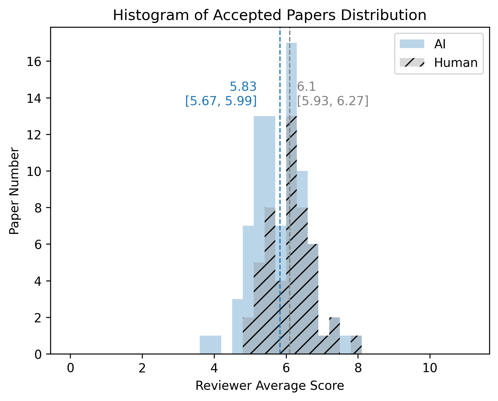
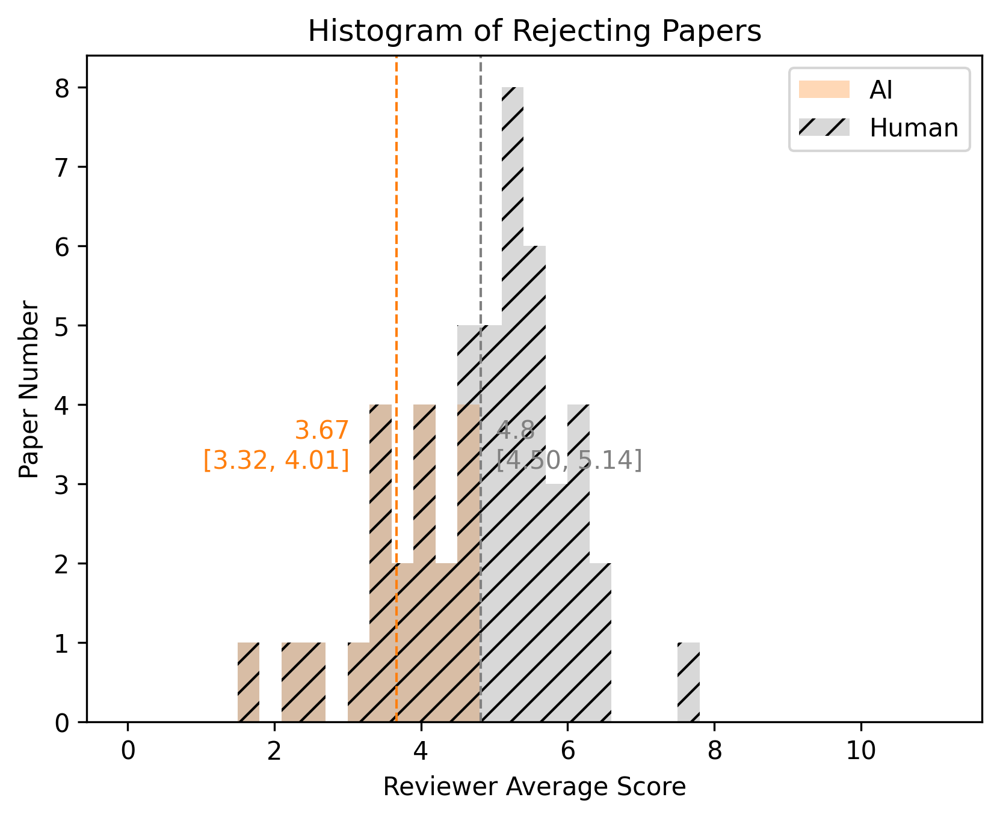
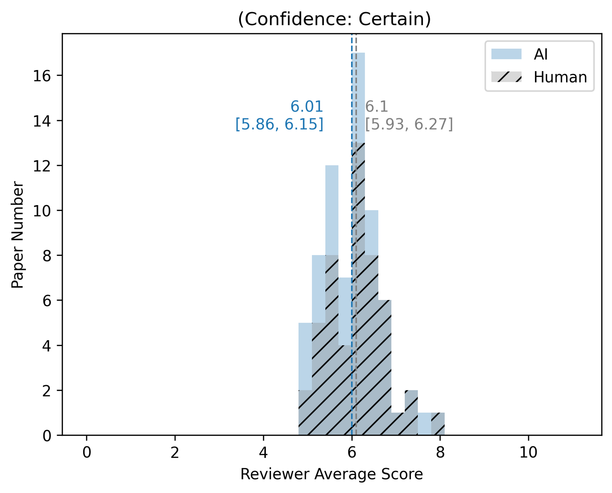
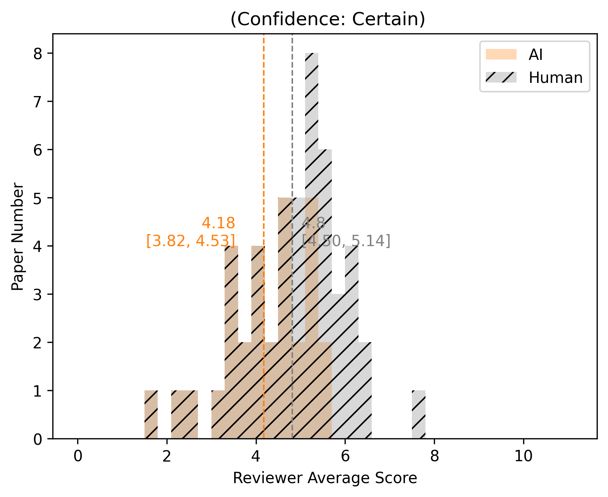

# Exploring the Feasibility of a Large Language Model as a Paper Reviewer

## Introduction

In light of the increasing integration of AI across various domains, it's natural to consider its applicability in scientific peer-review processes. This study delves into the potential role of a Large Language Model (LLM), like the OpenAI GPT series, in the paper reviewing process, and examines how its assessments align with those of human meta reviewers. Our analysis is based on an exploration of data sourced from the NeurIPS 2022 conference, incorporating review data available from [OpenReview.com](http://openreview.com/).

### Background: Paper Reviews

In the collection of paper reviews, each paper has 3 to 6 **general reviews**, along with a **meta review** that gives the final decision based on these reviews.

**General Review**

Usually, each paper has detailed general reviews from 3 to 6 different reviewers. These reviews include ratings for recommendation, confidence, soundness, and more. It's important to note that we only considered the feedback given during the first round of reviews and didn't look at any follow-up discussions. An example of a reviewer's review includes a "Summary" and some scores like "rating," "confidence," and "presentation":

> Summary: This paper studies a method of …
> …
> 
> Rating: 8: Strong Accept
> 
> Confidence: 3
> 
> Code Of Conduct: Yes
> 

**Meta Review**

The meta review gives the final decision, which can be "accept" or "reject." There's also a "confidence" rating that shows how sure the meta reviewer is about the decision, categorized as "Certain" or "Less Certain." Additionally, the meta reviewer provides an explanation or comment. Here's an example of a meta review:

> Recommendation: Accept
>
> Confidence: Certain
> 
> All reviewers recommend accepting the paper. But …
> 
> The paper will have greater influence if the final version can convince readers of its relevance to ML! 

The following sections shows our experiments by crafting a AI meta reviewer followed by analysis of what elements contribute to the trend of AI decision.

## The Initial Attempt: AI as Meta Reviewer

The initial stage of our experiment involved deploying the AI as a 'Meta Reviewer', utilizing the General Reviews as input and generating formatted Meta Reviews as output.

Our AI's output was tailored to match the conference guidelines: it expressed its level of confidence in the decision (ranging from high to lower confidence), delivered a recommendation (either Accept or Reject), and substantiated the recommendation with an explanation.

### Approach

In the implementation of the AI Meta Reviewer, to efficiently handle the substantial feedback provided by various reviewers, we employed the **`gpt-3.5-turbo-16k`** model from OpenAI, combined with Langchain’s `StuffDocumentsChain` to facilitate the process. The guiding prompt provided to the AI was structured as follows:

> Please act as a meta reviewer to give the final metareview based on reviews from other reviewers. Feel free to express the possible opinions. 
[The Start of Human Reviews]
…
[The End of Human Reviews]
The output format should be: 
"Recommendation: [Reject/Accept]  Meta Review: [Your review]…"
…
> 

**Assessment:** Upon receiving the AI-generated result, evaluating its performance becomes crucial. A straightforward metric for gauging alignment between AI and human reviewers is the `Acceptance Accuracy`, which quantifies the degree of agreement. Additionally, we conducted separate analyses for papers recommended for acceptance and those for rejection, in order to identify potential trends.

### Findings

Our "AI Meta Reviewer" achieved an overall accuracy rate of 67%. However, a closer examination of this statistic unveiled an inconsistency: it demonstrated a perfect accuracy rate of 100% for accepted papers, while recording a mere 34% accuracy for rejected ones. Upon closer examination, a noticeable variance between the average reviewer score of the AI and that of the human meta reviewer emerged, particularly in instances of paper rejections. 

We employed histograms to more effectively illustrate the differences in "averaged ratings" distribution between the AI and human reviewers when accepting or rejecting papers. For papers that were recommended as “accepted”, there exhibited comparable rating distributions. In contrast, for papers that were recommended as “rejected”, human reviewers tended to reject higher scores. This discrepancy underscored the AI's hesitancy to advise rejection, an aspect that became central to our following investigations.

 

In rejecting papers, AI tend to reject papers with lower averaged ratings than human do.

## **The 'Certain' Directive: Harnessing AI's Confidence**

One notable trend from the first experiment was the AI's propensity to be "less certain" about its decisions. To enhance its determination, especially in rejecting papers, we incorporated a soft directive. We prompted the AI to be more confident in making its final decisions, without necessarily directing its choice of accept or reject.

### **Results**

The addition of this directive led to significant changes. The overall accuracy jumped to 72%, with rejected paper accuracy surging from 34% to 52%. However, the accuracy for accepted papers did witness a slight decline to 92%. A histogram comparison indicated that post-directive, the AI's average score distribution for rejected papers was closer to human judgments (avg score 4.18 vs. 4.8) than before (3.66 vs. 4.8). Even though the accuracy for accepted papers went down slightly, the gap between the average reviewers ratings related to AI and human reviewers narrowed, with the AI averaging 6.01 compared to the previous 5.83, and the human average being 6.1.

 

## Ratings vs. Plain Context: What Weighs Heavier?

The above highlights how the direction of an AI's decision-making can be influenced by the nuances of a given prompt. A related question that arises is: what elements within the reviews significantly steer the AI Reviewer's decisions? While the ratings provided by each reviewer might offer a snapshot of the general impression of papers, how would the AI fare without them? To assess this, we excluded the "ratings" of each reviews, leaving only the plain text as context for the AI, and replicated the experiment without pushing the AI toward certainty.

**Results**: The overall accuracy declined to 59%, with rejection accuracy plummeting to 24% and acceptance accuracy holding steady at 94%. Clearly, the "rating" component plays a pivotal role in influencing AI decisions. Nevertheless, even though the AI leans on ratings for peak performance, its dependency can be adjusted by tailoring specific prompts as directives during the evaluation process.

## **Conclusion**

The experiments suggest the promising capabilities of LLMs as potential meta-reviewers. Yet, they also hint at the intricacies involved in aligning an AI's judgment with human insights, particularly in nuanced tasks like paper reviewing. While the LLM displayed commendable accuracy rates, notably when provided with the 'certainty' directive, its initial caution in rejecting papers indicates that reviewing isn't solely about quantitative metrics. The human perspective, shaped by years of experience, intuition, and a deep grasp of the scientific domain, is invaluable. Nevertheless, as we refine and learn from these experiments, there could be an emerging role for AI-assisted reviewing. In such a scenario, the unique strengths of human intuition and AI's data-driven approach might collaboratively contribute to even more refined review processes down the line.