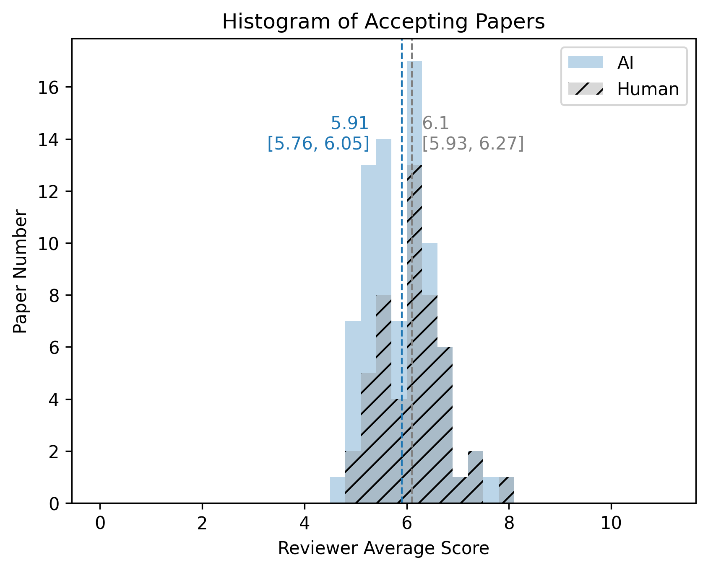

# Exploring AI's Role in Summarizing Scientific Reviews

## Introduction

As AI continues to find its place in diverse areas, we were curious about its possible role in the scientific peer-review process. This investigation focuses on exploring whether a Large Language Model, such as OpenAI GPT, could offer potentially assist in helping human readers to digest scientific reviews. Specifically, our study takes human reviews as the input, and ask AI to craft a "meta review" which gives an accept/reject recommendation of paper followed by the confidence of the remmendation and an explanation.

Our findings are:

- GPT is able to generate useful review summaries and "better than chance" accept/reject recommandations.
- GPT has a strong hesitancy to advise rejection.
- Several attributes, such as "certainty" and "human raiting", can have directive impact on AI's recommendation.

### Background: Paper Reviews

While having an AI directly critique scientific content remains a challenging and complex endeavor, our curiosity lies in its ability to help consolidate diverse human opinions into a cohesive recommendation. In essence, we're exploring if AI can simulate the process where seasoned domain experts, such as area chairs, distill general reviews into decisive meta reviews. For clarity, our examination is a simplied version of the real-world process: we've set aside aspects like the rebuttal process and the paper's content, and there is no constraint such as overall acceptance rate. Nevertheless, this endeavor aims to illuminate if AI can effectively summarize varied human perspectives and suggest informed decisions. Through this lens, we also hope to discern any inherent biases in current LLMs, especially when tasked with [nuanced decisions](https://blog.neurips.cc/2021/12/08/the-neurips-2021-consistency-experiment/) like paper acceptances.

To get a clearer picture, we looked into data from the NeurIPS 2022 conference, using review information from [OpenReview.com](http://openreview.com/): each paper has 3 to 6 **general reviews**, along with a **meta review** that gives the final decision based on these reviews. These reviews will be used as the inputs and "ground truth" output of our study.

**General Review**

Usually, each paper has detailed general reviews from 3 to 6 different reviewers. These reviews include ratings for recommendation, confidence, soundness, and more. It's important to note that we only considered the feedback given during the first round of reviews and didn't look at any follow-up discussions. An example of a reviewer's review includes a "Summary" and some scores like "rating," "confidence," and "presentation":

> Summary: This paper studies a method of …
> …
>
> Rating: 8: Strong Accept
>
> Confidence: 3
>
> Code Of Conduct: Yes

**Meta Review**

The meta review gives the final decision, which can be "accept" or "reject." Similarly, there's also a "confidence" rating that shows how sure the meta reviewer is about the decision, categorized as "Certain" or "Less Certain." Additionally, the meta reviewer provides an explanation or comment. Here's an example of a meta review:

> Recommendation: Accept
>
> Confidence: Certain
>
> All reviewers recommend accepting the paper. But …
>
> The paper will have greater influence if the final version can convince readers of its relevance to ML!

The following sections explain our experiments by crafting a AI meta reviewer followed by analysis of what elements contribute to the trend of AI decision.

## The Initial Attempt: AI as Meta Reviewer

The initial stage of our experiment involved deploying the AI as a 'Meta Reviewer', utilizing the General Reviews as input and generating formatted Meta Reviews as output.

Our AI's output was tailored to match the conference guidelines: it expressed its level of confidence in the decision (ranging from high to lower confidence), delivered a recommendation (either Accept or Reject), and substantiated the recommendation with an explanation.

### Approach

In the implementation of the AI Meta Reviewer, to efficiently handle the substantial feedback provided by various reviewers, we employed the **`gpt-3.5-turbo-16k`** model from OpenAI, combined with Langchain’s `StuffDocumentsChain` to facilitate the process. The guiding prompt provided to the AI was structured as follows:

> Please act as a meta reviewer to give the final metareview based on reviews from other reviewers. Feel free to express the possible opinions.
>
> 
> (The reviews as context)
> 
> 
> The output format should be:
> "Recommendation: [Reject/Accept] Meta Review: [Your review]…"
> …

**Assessment:** Upon receiving the AI-generated result, evaluating its performance becomes crucial. A straightforward metric for gauging alignment between AI and human reviewers is the `Decision Accuracy`, which quantifies the degree of agreement. Additionally, we conducted separate analyses for papers recommended for acceptance and those for rejection, in order to identify potential trends. Additionally, we employed the Kullback-Leibler Divergence (KL Divergence) to quantify the variance in distribution between AI and human reviewers. A lower KL Divergence signifies greater similarity between the two distributions.distributions are.

### Findings

In the assessment of our "AI Meta Reviewer," we conducted tests on a collection of 100 papers, equally divided between 50 accepted and 50 rejected submissions. The outcomes displayed promise, with the "AI Meta Reviewer" achieving a commendable accuracy rate of 70%. Notably, it achieved 100% accuracy in assessing accepted papers; however, its performance dropped to 40% accuracy for rejected submissions. Further analysis unveiled a conspicuous distinction between the average reviewer scores provided by the AI and those provided by human meta reviewers, particularly in cases of paper rejections.

Histograms help visualize this. For accepted papers, AI and human rating distributions were similar. But for rejections, the paper rejected by human tended have higher scores. This discrepancy underscored the AI's hesitancy to advise rejection, an aspect that became central to our following investigations.

 

## **Guiding the AI via Directive and Indirective Prompts**Please act as a meta reviewer to giv

To assist the AI in producing output that aligns more closely with human preferences, prompts are devised using two methods: directive and indirective. In terms of advising whether to "Accept" or "Reject," directive prompts explicitly tell the AI to lean towards acceptance or rejection, while indirective prompts subtly steer the AI towards a final decision. Within these prompt types, we introduce "Strictness" as a directive factor and "Certainty" as an indirective factor. "Strictness" ranges from 0 to 1, where higher values indicate a stricter approach. "Certainty" offers two choices: "Certain" and "Less Certain." Let's compare these two approaches and their outcomes.

### Directive Prompt - "Strictness"
We initially employed a directive prompt to guide the AI towards a more stringent decision-making process. An example prompt explains the concept of "strictness" and instructs the AI to be stricter in its decisions:
>"The strictness for this conference is 0.9, which is a float number between 0 and 1, higher is stricter.
> You should tend to reject a paper if the strictness is higher, and tend to accept a paper if the strictness is lower."

The inclusion of this directive had a notable impact. Overall accuracy increased to 71%, showing a significant improvement in accuracy for rejected papers (50%). However, the accuracy for accepted papers experienced a slight reduction to 92%. An analysis of histogram data revealed that post-directive, the AI's average score distribution for rejected papers became closer to human evaluations (average score 4.17 compared to 4.8) than before (3.66 compared to 4.8). Despite the minor drop in accuracy for accepted papers, the difference between average ratings assigned by reviewers to AI-generated content and human reviewers actually decreased from 0.27 to 0.12.  The KL Divergence also narrowed, reducing from 16.79 to 4.6.
 

### Indirective Prompt - "Certainty"
A standout observation from the first experiment was AI tends to be "less certain" about its decisions. To address this, we instructed the AI to be more decisive: we prompted the AI to be more confident in making its final decisions, without necessarily directing its choice of accept or reject. The formulation of this prompt aimed at bolstering the AI's sense of "certainty," as exemplified by the phrase:
>"Your confidence for this conference is 'certain', you should be more confident to give a final decision."

Interestingly, after this change, we didn't see a big difference in how reviewers rated papers for acceptance. However, something interesting happened: the AI became less accurate at rejecting papers, with a drop to 16% accuracy accompanied by an elevated KL Divergence of 19.73, while the accuracy for accepting papers stayed the same. This suggests that boosting the AI's sense of "certainty" seemed to make it lean more toward accepting papers as it did before, but it didn't have the same effect on rejecting papers.

 

### Ratings vs. Plain Context: What Weighs Heavier?
The above discussion underscores how an AI's decision-making process can be swayed by the subtle nuances present in a given prompt. A related query arises: which specific aspects within the reviews hold considerable sway over the decisions made by the AI Reviewer? While the scores assigned by reviewers offer a brief overview of their overall impressions of papers, what would be the outcome if these scores were absent for the AI to consider?

To explore this, we removed the "ratings" given by each reviewer, retaining only the plain textual content as context for the AI. We then replicated the experiment without guiding the AI toward making definite judgments. As a result, the overall accuracy dropped to 59%, and the accuracy of rejections decreased even further to 24%. This observation clearly underscores the substantial role that ratings play in shaping the AI's decision-making process.

Additionally, we introduced a constraint of strictness (set at 0.9) on top of the aforementioned setup. Interestingly, the accuracy of rejections surged to 70%, surpassing the acceptance accuracy of 60%. We posit that the reason behind this phenomenon could be that, in the absence of rating scores, the AI becomes more susceptible to being controlled by the explicit elements within the directive prompts.

## Examples

The following show examples of simplified human meta review v.s. AI meta review in terms of agreement and disagreement. We show the examples when strictness is 0.9 and confidence is "certain".

|Paper | URL: https://openreview.net/forum?id=pnSyqRXx73 |
| ----- | ---------------- |
| Human Meta Refiew | Recommendation: Accept Confidence: Certain All reviewers recommend accepting the paper. Congratulations! But in your camera-ready version, please revise the paper to better emphasize the relevance of this line work to a general machine learning audience. For example, during the discussion one reviewer wrote the following: "..." The paper will have greater influence if the final version can convince readers of its relevance to ML! |
| AI Meta Review | Recommendation: Accept Confidence: Certain Meta Review:   Based on the reviews from the other reviewers, it is clear that this paper makes a significant contribution to the field of solving functional inverse problems. The paper is well-organized, with clear examples and good mathematical exposition. The theoretical results are solid and the experimental results are interesting.   There are some minor issues raised by the reviewers, such as... Reviewer 2 raises concerns about ...   Reviewer 3 also raises a question .... Overall, this paper is technically strong, with novel ideas and excellent impact on the field. The evaluation, resources, and reproducibility are also of high quality. Therefore, I recommend accepting this paper. |

|Paper | URL: https://openreview.net/forum?id=pnSyqRXx73 |
| ----- | --------------- |
| Human Meta Refiew | Recommendation: Reject Confidence: Certain This work proposes a SDP approach to computing Wasserstein gradient direction for 2-layers NNs, without the need of training the underlying NN. To compute the gradient direction, the authors construct a least-square regression problem, and add a polynomial regularization term. Then, they show that the (relaxed) dual is an SDP problem. Pros The idea of casting the Wasserstein gradient direction as an SDP is novel, and interesting. It also paves the way to more general formulations The obtained optima is global  Cons The exposition is lacking some motivation at some points. I think the authors could ... I believe the idea of ... is interesting, but with respect to the ratio of pros/cons above, and the lack of a strong positive opinion on this work, I recommend to reject this submission in its current state. I encourage the authors to revise the manuscript ... |
| AI Meta Review | Recommendation: Reject Confidence: Certain Meta Review: Based on the reviews from other reviewers, it is clear that the paper has some strengths, such as proposing a convexification approach for a non-convex variational problem and providing a rigorous derivation of a relaxed SDP dual problem. However, there are also several weaknesses pointed out by the reviewers. These include the lack of intuitive explanations and comparisons with related work, the absence of a computational discussion, and the computational burden of the proposed method being 50x slower than training a neural net. Additionally, there are limitations in terms of the regularized primal problem, the function class being limited to two-layer neural networks, and the lack of theoretical guarantees for the convex program. The paper also lacks theoretical discussion and runtime comparisons for the proposed approach. Overall, while the idea is promising, the paper is considered premature and needs further work. |

The AI reviewer maintains a structure similar to that of a human reviewer, generating an output that includes the Recommendation and Confidence levels, followed by the review's content. However, when it comes to the actual content, the AI reviewer often leans towards a more generalized approach, whereas human reviewers exhibit a tendency to provide specific details. While varying perspectives between AI and human reviewers can arise when assessing paper acceptance, interestingly, there appears to be a convergence of opinions when it comes to rejecting a paper. We hypothesize that when confidence levels are higher in the decision to reject a paper, both AI and human reviewers source their justifications from the reviewer's input, leading to similarities in their explanations.

(For a comprehensive overview of the complete results, please refer to the [provided links](https://drive.google.com/drive/folders/1v7dJGFvOngPvONjLTDeCDkpWlzxwxvpo?usp=sharing) containing information on all the different settings.)

## **Conclusion**

The experiments suggest the promising capabilities of LLMs as potential meta-reviewers. Yet, they also hint at the intricacies involved in aligning an AI's judgment with human insights, particularly in nuanced tasks like paper reviewing. While the LLM displayed commendable accuracy rates, notably when provided with the 'certainty' directive, its initial caution in rejecting papers indicates that reviewing isn't solely about quantitative metrics. The human perspective, shaped by years of experience, intuition, and a deep grasp of the scientific domain, is invaluable. Nevertheless, as we refine and learn from these experiments, there could be an emerging role for AI-assisted reviewing. In such a scenario, the unique strengths of human intuition and AI's data-driven approach might collaboratively contribute to even more refined review processes down the line.
