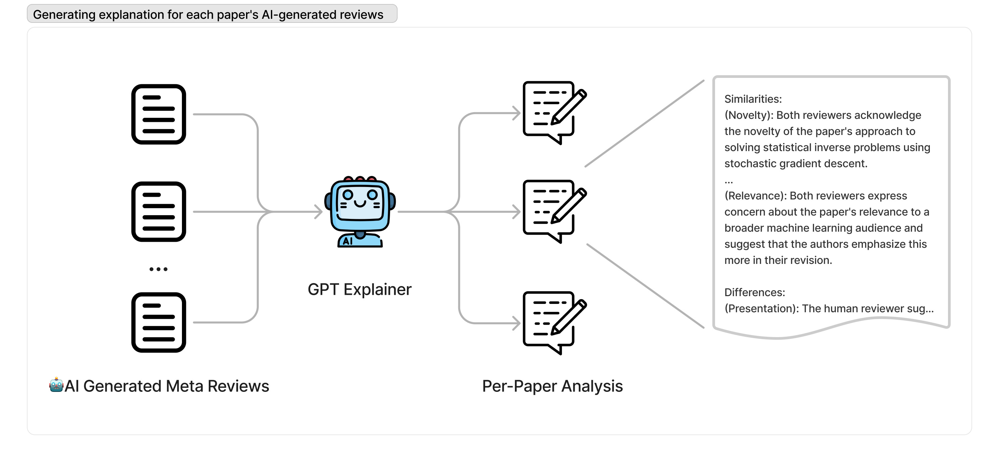

# The AI Explainer: Unraveling the Differences between AI and Human Reviewers

## Introduction
In our previous article, "Exploring AI's Role in Summarizing Scientific Reviews," we delved into the capabilities of GPT (Generative Pre-trained Transformer) in generating review summaries and providing accept/reject recommendations. While the AI exhibited proficiency in generating useful summaries and recommendations better than chance, it displayed a strong inclination towards acceptance. To understand the factors influencing these results, we investigated aspects like directive guidance "strictness" and indirective "certainty," revealing differences between the AI and human meta-reviewers in terms of performance. We utilized metrics such as accuracy, KL divergence, and histogram comparison to highlight the disparities between AI and human reviewers. However, a crucial element remained unexplored: what drives these divergent decisions? To address this, we set out to comprehend the areas of agreement and disagreement between AI and human reviewers. Thus, we introduce the "AI explainer" to elucidate both the similarities and differences in their reviews.

To answer the question why AI has different views as Humans, we want to know in what aspects do human and AI act similarly or differently. The ongoing difference in opinions between AI and humans presents a tough problem. To understand why AI and humans think differently, we suggest using another AI to explain how the AI makes decisions. This study aims to make AI's decision-making clearer and more transparent. We also want to see if AI can give structured information, especially in numbers, by finding out where AI and humans mostly agree or disagree.

While this task presents significant challenges in real-life scenarios, as it demands substantial human effort to read and summarize reviews comprehensively, GPT emerges as an ideal candidate due to its remarkable summarization capabilities. Nevertheless, generating structured information directly from GPT poses challenges, including handling long inputs comprising 100 reviews and producing statistical structured output, such as the frequency of the most discussed aspects. 

## AI explainer

The experiments conducted employ the same dataset as before, consisting of 100 NeurIPS 2020 papers and their corresponding meta-reviews—50 accepted and 50 rejected papers. We base our AI explainer on OpenAI GPT-3.5-Turbo-16k, leveraging its high capacity for processing lengthy inputs. 

### Distilling Key Points

Our initial approach, following OpenAI's best practices: [Tactic: Instruct the model to work out its own solution before rushing to a conclusion ](https://platform.openai.com/docs/guides/gpt-best-practices/tactic-instruct-the-model-to-work-out-its-own-solution-before-rushing-to-a-conclusion),is to generate summaries for each paper detailing the similarities and differences between AI and human reviews. We employ a straightforward prompt to instruct OpenAI GPT to identify up to three aspects on which AI and human reviews agree or disagree:

> Please act as an impartial explainer and evaluate the similarity and difference of the responses provided by a human meta reviewer (a) and AI reviewer (b) to a submitted paper. Avoid any position, length and order biases to influence your evaluation.
>
> List up to 3 aspects they agree/disagree, focusing on their explanation but not the" difference of their final recommendation or confidence. The aspects ([Aspect]) can be 'Novelty', 'Soundness', 'Presentation', 'Contribution', 'Related Work', 'Reproducibility', 'Ethics', 'Broader Impact', 'Correctness', 'Clarity', 'Strengths', 'Weaknesses', 'Relation to Prior Work', 'Additional Feedback', 'Questions for the Authors', or any other aspects you can give.
>
> Follow the format:
> Similarities:(Aspect 1): [explanation] 
> (Aspect 2): [explanation] 
> (Aspect 3): [explanation] 
> Differences:
> (Aspect 1): [explanation] 
> (Aspect 2): [explanation] 
> (Aspect 3): [explanation] 

The workflow for this step is illustrated below, with the AI explainer extracting key aspects from each paper's reviews, assessing whether there is agreement or disagreement between the human and AI perspective

#### Results

Here is a sample result providing a paper review explanation. By structuring our analysis as described earlier, we acquire per-paper reviews that emphasize crucial aspects where human and AI reviews align or differ. This presentation accurately summarizes a broader comparison across various aspects. Notably, these aspects extend beyond those explicitly mentioned in the prompt, including "Relevance," which is introduced by the AI explainer. This step lays the groundwork for a more in-depth analysis of each aspect's summary.

Aspects where human and AI reviewers agree on (similarities):

> Similarities:
>
> (Novelty): Both reviewers acknowledge the novelty of the paper's approach to solving statistical inverse problems using stochastic gradient descent.
>
> (Soundness): Both reviewers agree on the technical strength of the paper, with clear examples and mathematical exposition.
>
> (Relevance): Both reviewers express concern about the paper's relevance to a broader machine learning audience and suggest that the authors emphasize this more in their revision.

Aspects where human and AI reviewers disagree (differences):

> Differences:
>
> (Presentation): The human reviewer suggests that the authors mention machine learning applications of their method early in the paper to pique reader interest, while the AI reviewer does not make this specific suggestion.
>
> (Strengths and Weaknesses): The AI reviewer mentions concerns about the completeness and consistency of the experimental results, which the human reviewer does not mention.
>
> (Confidence): The human reviewer is certain about their recommendation to accept the paper, while the AI reviewer is less certain due to the concerns raised by the reviewers and the need for further clarification on the limitations and advantages of the proposed method.

### Detailed Aspect-Level Analysis

To gain deeper insights into the aspects on which human and AI reviewers concur or differ, we perform a more extensive analysis at the aspect level. Our prompt for this analysis is:

> Summarize a collection of similarities of the aspect {aspect} of Human/AI reviewers on 100 papers: 
>
> {context}
>
> Explain what can you find worth mentioning from these information. Give discussion in a higher level, do not mention method/paper details. The output format should be point by point.

#### Results on Aspects of Similar Viewpoints

An example of our deeper aspect-level analysis, focusing on "Novelty" is as follows:

> 1. Both human and AI reviewers consistently acknowledge the novelty of the papers in various fields, such as...
> 2. The reviewers appreciate the introduction of novel approaches, ...
> 3. In some cases, the reviewers specifically mention the importance of the ..
> 4. There are instances where the reviewers acknowledge the novelty of the proposed algorithms, models ...
>
> ...
>
> Overall, the collection of similarities highlights the consistent recognition of novelty in the majority of the reviewed papers, indicating the importance of introducing new approaches, methods, and frameworks in various fields of research.

By initially summarizing at the paper level and then drilling down to the aspect level, we gain detailed, point-by-point explanations of the similarities between human and AI reviews.

#### Results on Aspects of Different Viewpoints

Our analysis reveals that "Presentation" is the aspect where human and AI reviews diverge the most, with 34 instances of disagreement. Here's an example of our analysis for this aspect:

> 1. The human reviewers often provide specific suggestions for improving the presentation of the papers, such as mentioning machine learning applications early on, emphasizing computational efficiency, and improving writing and presentation to highlight contributions. The AI reviewers, on the other hand, do not make these specific suggestions.
> 2. The AI reviewers tend to comment on the readability and clarity of the papers more frequently than the human reviewers. They mention concerns about small figures, dense writing, difficulties in understanding certain figures, and the need for more explanations and definitions of key concepts.
> 3. The human reviewers sometimes criticize the papers for lacking depth, realism, real impact, or a well-motivated or well-described restriction. The AI reviewers, however, do not mention these aspects.
> 4. The AI reviewers often commend the papers for being well-written, well-organized, easy to follow, and providing clear explanations and visualizations. The human reviewers, on the other hand, do not frequently comment on these aspects.
> 5. The human reviewers occasionally point out specific issues with the presentation, such as poorly formatted references or mistakes in citation codes. The AI reviewers, however, do not mention these issues.
> 6. The human reviewers sometimes suggest major revisions or additional discussions, plots, or sections for improving the papers. The AI reviewers, on the other hand, do not often provide specific areas for improvement.

The result clearly compares how the human and AI holding their viewpoints in the "Presentation" aspect in reviewing papers. This is a summary from 100 papers which is a general high-level conclusive comparison.

### The Quantitative Analysis Capacity of AI

In the realm of analysis, it is vital to consider the quantitative aspects. We sought to determine whether AI could directly engage in this, providing a concise summary of the areas where both human and AI reviewers find common ground. This endeavor is crucial in identifying the aspects of utmost importance. To this end, after accumulating succinct summaries for each paper, we tasked GPT with examining the prevalence of the most discussed aspects, thereby introducing a structured element into the analysis. The prompt for this task is provided below:

> Summarize an analysis of differences of human/AI meta reviews:
> {The 100 analysis from the previous step}
> Find out the common aspects that human and AI reviewers agree on. If possible, give the estimated frequency of each aspect.

#### Results

Below are instances illustrating the counts generated by AI for each aspect based on the previous analysis. It's worth noting that AI's counts may not be entirely accurate; for instance, GPT might indicate that only 45 papers mention "Novelty," whereas manual counting reveals over 90 instances. This disparity underscores a notable limitation in current AI technology—its quantitative analysis of textual data is still a work in progress.

**Similarities**

> - Novelty: This aspect is mentioned in 45 out of 100 papers. For example, in paper 5, both human and AI reviewers agree that the paper presents a novel approach to designing equivariant neural networks for materials science.
> 2. Soundness: This aspect is mentioned in 42 out of 100 papers. For example, in paper 6, both reviewers acknowledge the technical soundness of the paper's results and execution.
> 3. Weaknesses: This aspect is mentioned in 32 out of 100 papers. For example, in paper 11, both reviewers highlight the concerns raised by other reviewers about the significance of the improvement compared to non-greedy OCRSs.
> 4. Presentation: This aspect is mentioned in 19 out of 100 papers. For example, in paper 20, both reviewers appreciate the clear writing and presentation of the paper.
> 5. ...

**Differences**

> 1. Confidence in Recommendation:
>    - Frequency: 15 papers
>    - Examples: Papers 3, 4, 5, 7, 8, 9, 11, 13, 15, 16, 18, 20, 21, 23, 25
> 2. Presentation:
>    - Frequency: 9 papers
>    - Examples: Papers 1, 7, 12, 27, 28, 43, 57, 68, 77
> 3. Reproducibility:
>    - Frequency: 8 papers
>    - Examples: Papers 1, 2, 3, 7, 27, 33, 35, 58
> 4. Related Work:
>    - Frequency: 8 papers
>    - Examples: Papers 2, 6, 7, 13, 27, 35, 42, 57
>
> ...

## Conclusion

Our exploration of AI's role in scientific paper analysis has yielded important insights. The "AI explainer" methodology demonstrated AI's capacity to summarize and compare review aspects, enhancing transparency in decision-making. However, in quantitative analysis, AI currently falls short of manual counting accuracy.

In summary, AI holds promise in streamlining scientific reviews but requires further refinement for quantitative tasks. As we navigate this landscape, we must acknowledge both AI's potential and its ongoing development in the realm of scientific research.
